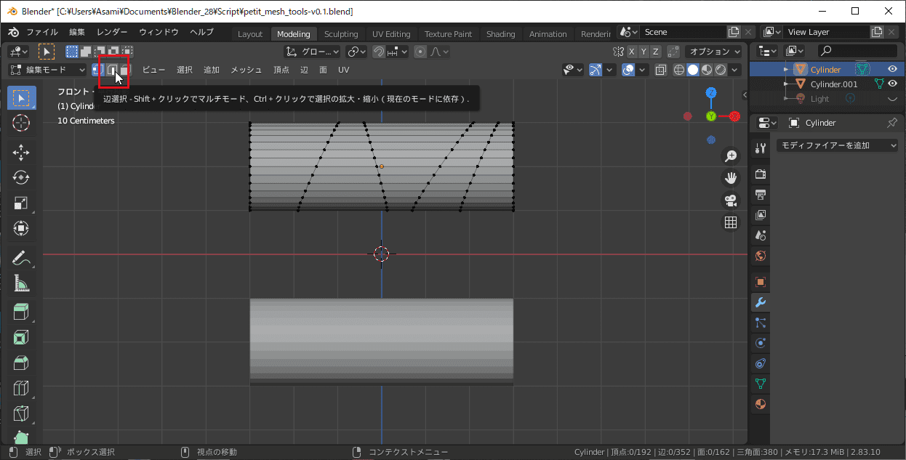
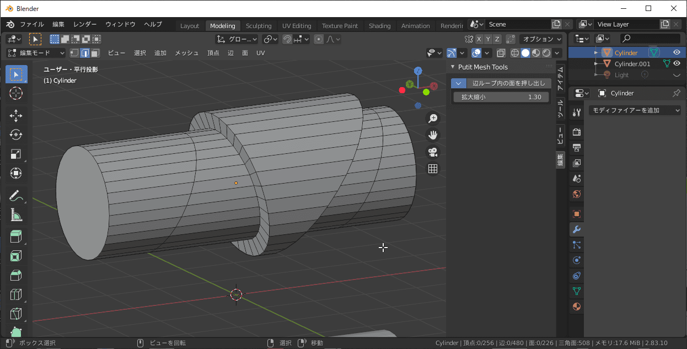

# Petit Mesh Tools

## Petit Mesh Toolsについて

『Petit Mesh Tools』は、Blenderでのメッシュ編集を少し便利にするような機能を追加するアドオンです。  
Blender 2.83以降に対応しています。

## ダウンロード

[最新バージョンをダウンロードする](https://github.com/samia-done/Petit-Mesh-Tools/releases/latest/download/petit_mesh_tools.zip)  

## インストール方法

1. Blenderの［編集］メニュー→［プリファレンス］の順にクリックして、［Blenderプリファレンス］画面を開きます。  

1. ナビゲーションバーにある［アドオン］をクリックして、アドオンセクションを表示します。  

1. ［インストール］ボタンをクリックして［Blenderファイルビュー］の画面を開きます。  

1. ダウンロードした［Petit Mesh Tools］のZipファイルを選択し、［アドオンをインストール］ボタンをクリックします。  

1. ［Petit Mesh Tools］の左にある［アドオンを有効化］にチェックをつけて、アドオンを有効にします。  

1. ［Save Preferences］ボタンをクリックして、設定を保存します。  

## 使い方

アドオンをインストールすると、メッシュの［編集モード］の［編集］タブに、［Putit Mesh Tools］パネルが追加されます。  

### 辺ループ内の面を押し出し

2つ以上選択した辺ループの内側にある面を押し出すツールです。  
［法線に沿って面を押し出し］(Alt+E)と似ていますが、チューブを斜めにカットしたような形状の場合に、押し出した断面をフラットに保ちます。  

1. メッシュの［編集モード］で、［辺選択］のみを有効にします。  

1. ［編集］タブの［拡大縮小(スケール)］ボックスに、押し出す量を数値で入力します。  

1. 押し出ししたい範囲のループ状になっている辺を2つ以上選択します。  
1. ［編集］タブにある［辺ループ内の面を押し出し］ボタンをクリックします。  

1. 選択した辺ループの内側にある面が押し出されました。  

#### 注意

- チューブのような閉じたループにしか対応していません。

## アップデート方法

本アドオンは、［Blenderプリファレンス］画面からアドオンの最新バージョンに更新することができます。
アドオンを更新する際には、Blenderを終了して開き直してから行うようにしてください。

1. Blenderの［編集］メニュー→［プリファレンス］の順にクリックして、［Blenderプリファレンス］画面を開きます。
1. ナビゲーションバーにある［アドオン］をクリックして、アドオンセクションを表示します。  

1. ［Petit Mesh Tools］の左にある［下向き三角］をクリックして、アドオンの設定パネルを開きます。
1. ［アドオンの更新を確認する］ボタンをクリックします。  

1. アドオンに更新があった場合には、［最新リリースバージョンに更新する］ボタンが表示されます。  
［最新リリースバージョンに更新する］ボタンをクリックします。
1. アドオンが更新されました。Blenderを再起動してください。  

## ライセンス

[GPL License](./LICENCE)

## 著者

GitHub:[Samia](https://github.com/samia_done)  
Twitter:[@samia_done](https://twitter.com/samia_done)
